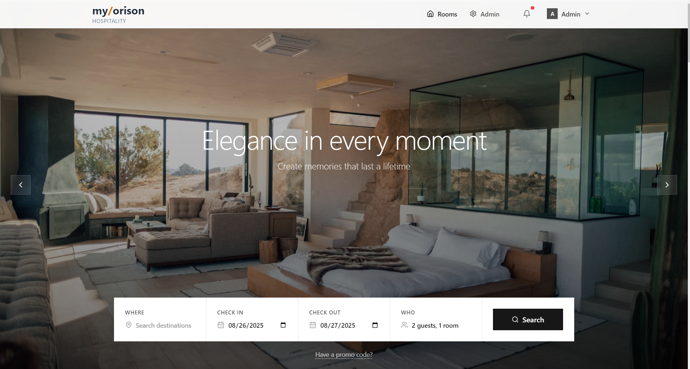

# Hotel Room Booking System

A comprehensive full-stack hotel room booking system built with React, Node.js, Express, and a file-based storage system. Features real-time room availability tracking, booking management, and a complete admin panel.

(image2.png)

## 🌟 Features

### Frontend Features
- **Live Room Availability Dashboard** - Real-time stats displayed in hero section
- **Interactive Room Grid** - Beautiful card-based room display with filtering
- **Advanced Search & Filtering** - Filter by type, availability, price range
- **Booking Modal** - Seamless room booking with date validation
- **Admin Panel** - Complete CRUD operations for room management
- **Real-time Updates** - Auto-refresh every 30 seconds
- **Responsive Design** - Optimized for mobile, tablet, and desktop
- **Toast Notifications** - User feedback for all actions
- **Loading States** - Smooth loading indicators throughout

### Backend Features
- **RESTful API** - Complete set of endpoints for room management
- **Data Validation** - Input validation using Joi
- **Error Handling** - Comprehensive error middleware
- **Security** - CORS, Helmet, Rate limiting
- **File-based Storage** - JSON file storage with automatic initialization
- **Real-time Stats** - Live occupancy and availability calculations

## 🚀 Quick Start

### Prerequisites
- Node.js 16+ 
- npm or yarn

### Installation

1. **Clone the repository**
   ```bash
   git clone <repository-url>
   cd hotel-booking-system
   ```

2. **Install Backend Dependencies**
   ```bash
   cd backend
   npm install
   ```

3. **Install Frontend Dependencies**
   ```bash
   cd ../
   npm install
   ```

4. **Start the Backend Server**
   ```bash
   cd backend
   npm run dev
   ```
   The backend will run on `http://localhost:5000`

5. **Start the Frontend Development Server**
   ```bash
   cd ../
   npm run dev
   ```
   The frontend will run on `http://localhost:5173`

## 🏗️ Project Structure

```
hotel-booking-system/
├── backend/                    # Node.js/Express backend
│   ├── data/                  # JSON data storage
│   ├── middleware/            # Express middleware
│   ├── models/               # Data models
│   ├── routes/               # API routes
│   ├── package.json
│   └── server.js            # Entry point
├── src/                      # React frontend
│   ├── components/          # React components
│   │   ├── Admin/          # Admin panel components
│   │   ├── Hero/           # Hero section
│   │   ├── Layout/         # Header, Footer
│   │   ├── Rooms/          # Room components
│   │   └── UI/             # Reusable UI components
│   ├── context/            # React Context
│   ├── hooks/              # Custom hooks
│   ├── services/           # API services
│   ├── types/              # TypeScript types
│   └── App.tsx            # Main App component
├── package.json
└── README.md
```

## 🔌 API Endpoints

### Room Management
- `GET /api/rooms` - Get all rooms with optional filtering
- `GET /api/rooms/stats` - Get availability statistics
- `GET /api/rooms/:id` - Get specific room
- `POST /api/rooms` - Create new room
- `PUT /api/rooms/:id` - Update room
- `DELETE /api/rooms/:id` - Delete room

### Booking Operations  
- `POST /api/rooms/:id/book` - Book a room
- `POST /api/rooms/:id/checkout` - Checkout from room

### Query Parameters (GET /api/rooms)
- `type` - Filter by room type (single, double, suite, deluxe)
- `available` - Filter by availability (true/false)
- `minPrice` - Minimum price filter
- `maxPrice` - Maximum price filter  
- `search` - Search in room number, type, description

### Example Requests

**Get available rooms:**
```bash
GET /api/rooms?available=true&type=suite
```

**Book a room:**
```bash
POST /api/rooms/123/book
Content-Type: application/json

{
  "guestName": "John Doe",
  "checkInDate": "2025-01-15",
  "checkOutDate": "2025-01-18"
}
```

## 🎨 Component Architecture

### Core Components

**Layout Components:**
- `Header` - Navigation with view switcher
- `Footer` - Site footer with contact info

**Room Components:**
- `RoomGrid` - Main room display grid
- `RoomCard` - Individual room card
- `RoomFilters` - Search and filter controls
- `BookingModal` - Room booking interface

**Admin Components:**
- `AdminPanel` - Complete admin dashboard
- Room creation/editing modals
- Statistics dashboard

**UI Components:**
- `LoadingSpinner` - Reusable loading indicator
- `Toaster` - Toast notification system

### State Management
- **RoomContext** - Global room state management
- **Custom Hooks** - Reusable logic (`useApp`)
- **Local State** - Component-specific state

## 💾 Data Schema

### Room Object
```typescript
{
  id: string;                    // Unique identifier
  roomNumber: string;            // Room number (unique)
  type: 'single' | 'double' | 'suite' | 'deluxe';
  price: number;                 // Price per night
  isBooked: boolean;             // Booking status
  guestName?: string;            // Guest name (if booked)
  checkInDate?: string;          // Check-in date
  checkOutDate?: string;         // Check-out date
  amenities: string[];           // List of amenities
  description: string;           // Room description
  imageUrl?: string;             // Room image URL
  createdAt: string;            // Creation timestamp
  updatedAt: string;            // Last update timestamp
}
```

### Statistics Object
```typescript
{
  total: number;                 // Total rooms
  available: number;             // Available rooms
  booked: number;                // Booked rooms
  occupancyRate: number;         // Occupancy percentage
}
```

## 🔧 Configuration

### Environment Variables
Create `.env` files in both frontend and backend:

**Backend (.env):**
```
PORT=5000
NODE_ENV=development
```

**Frontend (.env):**
```
VITE_API_URL=http://localhost:5000/api
```

### Customization

**Adding New Room Types:**
1. Update the `RoomType` enum in `src/types/room.ts`
2. Add validation in `backend/routes/rooms.js`
3. Update UI components to handle new type

**Modifying Auto-refresh Interval:**
```typescript
// In src/context/RoomContext.tsx
const interval = setInterval(() => {
  fetchRooms();
  fetchStats();
}, 30000); // Change to desired interval in ms
```

## 🧪 Testing

### Manual Testing Checklist
- [ ] Room creation/editing/deletion
- [ ] Room booking and checkout
- [ ] Search and filtering functionality
- [ ] Real-time updates
- [ ] Responsive design on different devices
- [ ] Error handling and validation

### API Testing with curl
```bash
# Get all rooms
curl http://localhost:5000/api/rooms

# Get room stats
curl http://localhost:5000/api/rooms/stats

# Create a room
curl -X POST http://localhost:5000/api/rooms \
  -H "Content-Type: application/json" \
  -d '{"roomNumber":"301","type":"suite","price":250,"description":"Luxury suite"}'
```

## 🚀 Production Deployment

### Backend Deployment
1. Set `NODE_ENV=production`
2. Configure proper CORS origins
3. Set up process manager (PM2)
4. Configure reverse proxy (nginx)

### Frontend Deployment  
1. Build the application: `npm run build`
2. Deploy to static hosting (Vercel, Netlify)
3. Update API URL in environment variables

### Performance Optimizations
- Image optimization and lazy loading
- API response caching
- Database indexing (when migrating to DB)
- CDN for static assets

## 🤝 Contributing

1. Fork the repository
2. Create a feature branch: `git checkout -b feature-name`
3. Make your changes
4. Commit changes: `git commit -m 'Add feature'`
5. Push to branch: `git push origin feature-name`
6. Submit a pull request

## 📝 License

This project is licensed under the MIT License - see the LICENSE file for details.

## 🐛 Known Issues & Future Enhancements

### Known Issues
- File-based storage has concurrency limitations
- No real-time WebSocket updates (uses polling)

### Planned Enhancements
- [ ] MongoDB/PostgreSQL integration
- [ ] WebSocket real-time updates  
- [ ] Payment processing integration
- [ ] Email notifications
- [ ] Booking calendar view
- [ ] Room maintenance scheduling
- [ ] Guest check-in/check-out QR codes
- [ ] Revenue analytics dashboard

## 📞 Support

For issues and questions:
1. Check the existing issues
2. Create a new issue with detailed description
3. Include steps to reproduce
4. Provide environment details

---

Built with ❤️ using React, Node.js, and modern web technologies.
